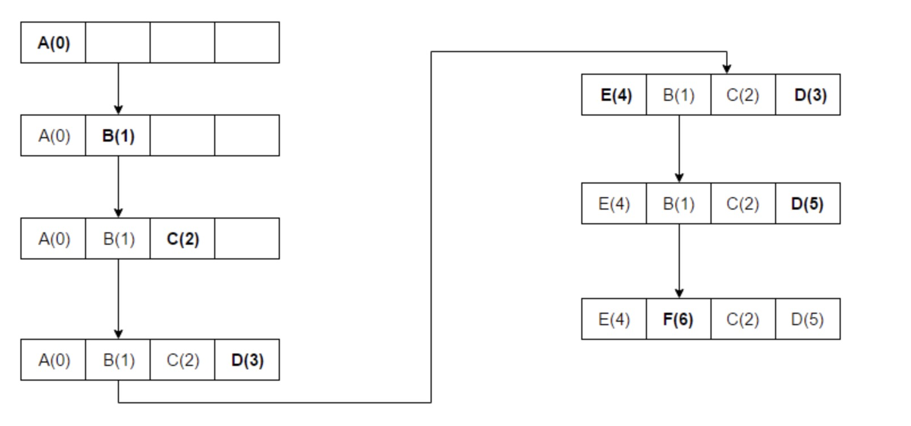

## 1. 什么是LRU
LRU  英文全称 ”Least Recently Used“，即最近最少使用，属于典型的内存管理算法。

LRU用通俗的话来说就是最近被频繁访问的数据会具备更高的留存，淘汰那些不常被访问的数据。

思考下LRU的衍生背景，为什么要有淘汰机制，势必是由于内存昂贵性使然，抽象出来就是我们必须有一个固定长度的列表来存储数据，LRU便是列表进出的一种可选机制。

此处引用谷歌维基百科上的一个图：



## 2. LRU实现思路

根据上图，直观感受到的关键词：数组、HashMap

数组用来指定存储的长度

HashMap用来存储数据被访问的次数

那么有几个关键点需要去达成：
1. 数组有长度限制
2. 要满足有序性，按时间排序，快速获取时间相关性
3. key-value性质数据

正常的哈希表是无序的，因此在这里引出了`哈希链表`的术语。

在Java中存在`LinkedHashMap`数据结构，即为哈希链表型数据结构。

同理在Python中也存在类似的数据结构，即为OrderedDict结构，该结构内置在Python的collections包中，OrderedDict是dict的子类，但是存储在内部的元素是有序的。

对于一些没有哈希链表数据结构的语言，可以采用哈希表+双向链表的思路来实现哈希链表，为什么是双向链表？因为在每次的访问中，都会出现元素变更的操作，比如说头部元素挪到了尾部这种，这种操作需要具备较强的灵活性和较低时间复杂度，双向链表正好可以满足。

实现思路一句话概括：

每访问一次数据，都把最新的访问数据放到链表头部，那链表尾部的数据就是最近没有访问过的数据。
当链表满了，从链表尾部开始往前删除指定数目的数据，在常数级时间内即可腾出空间。

正常LRU对外的接口主要是两个：

- PUT 即有新的缓存数据产生。

写入哈希链表时，需要判断是否存在链表中。
如果存在，则移除老的数据，将新的数据添加到链表头部；
如果不存在且链表容量未满，则直接添加到链表头部即可；
如果不存在但是链表容量已经满了，则把链表尾部数据删除，将该数据添加至链表头部即可。

- GET 即获取缓存数据。
读取哈希链表时，同样需要判断key是否存在链表中。
如果不存在，则直接返回不存在即可；
如果存在，则将命中缓存的key移除，将新的数据key添加至链表头部

通过这两个方法的逻辑，链表最终保持为链表头部最近访问，链表尾部即为最近不常访问的数据。


## 3. LRU实现代码

### 3.1 Python实现方法

正如上文所述，Python自己提供了一套数据结构

```
class LRUCache:

  def __init__(self, capacity):
      self.capacity = capacity
      self.queue = collections.OrderedDict()
  def get(self, key):
      if key not in self.queue:
          return False // key不存在则返回false
      value = self.queue.pop(key) // 移除命中缓存的key
      self.queue[key] = value // 将该key重新添加到dict头部
      return self.queue[key]

  def put(self, key, value):
      if key in self.queue: // 已经在缓存中，先移除
          self.queue.pop(key)
      elif len(self.queue.items()) == self.capacity:
          self.queue.popitem(last=False) // 不在缓存中并且到达最大容量，则把尾部数据key淘汰
      self.queue[key] = value // 将新数据key添加到头部
```


### 3.2 Golang实现方法

golang里实现时即是采用双向链表已经哈希表结合实现。


```
import (
    "container/list"
)


type entry struct {
    key int
    value int
}

// LRUCache 包含容量、链表、哈希表
type LRUCache struct {
    capacity int
    evictList *list.List
    items map[int]*list.Element
}

// Constructor 构造函数
func Constructor(capacity int) LRUCache {
    c := LRUCache{
        capacity: capacity,
        evictList: list.New(),
        items: make(map[int]*list.Element),
    }
    
    return c
}

// Get 获取缓存中的key
func (c *LRUCache) Get(key int) int {
    if ent, ok := c.items[key]; ok { // 如果存在哈希表中
        c.evictList.MoveToFront(ent) // 将该元素移至头部
        return ent.Value.(*entry).value
    }
    
    return -1
}


// Put 写入新的缓存数据
func (c *LRUCache) Put(key int, value int)  {
    if ent, ok := c.items[key]; ok { 
	      // 如果新写的缓存数据已经存在，则将该数据移至头部
        c.evictList.MoveToFront(ent)
        ent.Value.(*entry).value = value
        return
    }
    
    // 如果不存在，将新元素写入头部
    ent := &entry{key, value}
    entry := c.evictList.PushFront(ent)
    c.items[key] = entry
    
    //  写入后容量超限，则将尾部数据移除
    if c.evictList.Len() > c.capacity {
        c.removeOldest()
    }
}

func (c *LRUCache) removeOldest() {
    ent := c.evictList.Back()
    if ent != nil {
        c.removeElement(ent)
    }
}

func (c *LRUCache) removeElement(e *list.Element) {
    c.evictList.Remove(e)
    kv := e.Value.(*entry)
    delete(c.items, kv.key)
}

```

## 4. LRU应用场景

说到场景，比如说：
1. 底层的内存管理，页面置换算法
2. 一般的缓存服务，memcache\redis之类
3. 部分业务场景

