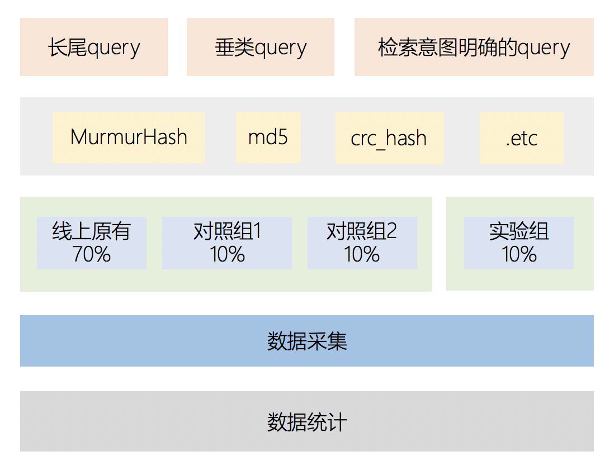

## 1 引言
如何做好互联网产品优化，对产品经理和业务研发来说都是需要关注的。一般来说我们都会有一套完善的产品监控机制，除了监控之外，还会有一些类似问卷调查、电话调研、竞品分析、团队内部试用反馈等方法，除了这些，还有一种很重要的方式，即数据分析，围绕数据做的测试、分析、监控等。

## 2 检索业务核心指标

* 点展比
	* 搜索结果的匹配程度
* 付费转化率
	* 搜索结果的质量

针对搜索结果的优化策略有很多种，有以线性权重调优的结果展现也有以根据用户动态浏览点击调整的模型输出，不管是哪种策略，都需要在不影响线上用户体验的情况下，尽可能的提升点展比和付费转化率，而新的策略是否对线上结果有正向反馈，便是结合ABtest来做实验效果验证。

## 3 ABtest分流机制

### 3.1 什么是ABtest
ABTest就是将用户分成不同的组，同时在线试验产品的不同版本，通过用户反馈的真实数据来找出采用哪一个版本方案更好的过程。我们将原始版本作为对照组，以每个版本按照一定流量迭代作为原则去使用 ABTest。一旦指标分析完成，用户反馈数据表现最佳的版本再去全量上线。
ABtest 的目的在于通过科学的实验设计、流量分割与小流量测试等方式来获得具有代表性的实验结论，并确信该结论在推广到全部流量可信。ABTest本身其实是物理学的“控制变量法”，通过只改变一个因素来确定其变化对目标指标或者收益的影响。其本身具备统计意义，而且具备实际意义。
ABTest 的实现是一个涉及面较多的系统工程，其解决方案涵盖工程架构和数据科学两大领域。 

### 3.2 业务分流策略

整体概述图如下：下文会针对流量抽样模块、实验组分配、数据采集、数据分析几个点来分别进行描述。

### 3.3 流量抽样模块：Hash算法选型

流量抽样模块是上述分流策略图中的
抽样是 abtest 实验的很重要的环节，抽样将线上流量划分成n份， 手段是通过一个hash算法， 对uid、cuid、随机种子做hash后对n取模分流。

#### 3.3.1  选型依据

选型依据从以下几个点说明：

* 性能开销
	* Hash算法的复杂度主要由算法是否包含加密逻辑来决定，加密Hash算法的计算速度要慢于非加密Hash算法。
	* 非加密的字符串Hash算法：用在数据存储领域，主要是对数据的索引和对容器的结构化支持，比如哈希表。
	* 加密Hash算法：用于数据/用户核查和验证。一个强大的加密哈希算法很难从结果再得到原始数据。加密哈希函数用于哈希用户的密码，用来代替密码本身保存在服务器上。加密哈希函数也被视为不可逆的压缩功能，能够代表一个信号标识的大量数据，可以非常有用的判断当前的数据是否已经被篡改(比如MD5)，也可以作为一个数据标志使用，以证明了通过其他手段加密文件的真实性。
* 冲突概率
	* 求Hash碰撞概率的问题可以转换成 [生日问题](https://en.wikipedia.org/wiki/Birthday_attack#Mathematics) ，维基百科中给出了比较严格的数学推导。

#### 3.3.2 推荐方案：MurmurHash算法

基于以上选型依据，推荐在进行非加密的字符串Hash操作时使用 [MurmurHash算法](https://sites.google.com/site/murmurhash/) ，这里有算法的具体实现代码MurmurHash算法具备高运算性能，低碰撞率的优势。

* 优势：
	* HBase、Hadoop、nginx、Redis、Memcached、Cassandra、Lucene、Guava、libmemcached、libstdc++等系统均有广泛应用
	* 高运算性能，计算速度非常快，是md5的十倍左右
	* 低碰撞率

#### 3.3.3 其他说明

其他的 hash 算法也有很多，包括DJBHash，BKDRHash，APHash，JSHash，RSHash，SDBMHash，PJWHash，ELFHash，simple_hash，CRC_hash等等，评价一个哈希算法的好坏，通常会引用SMHasher测试集的运行结果。这是一个c++实现的 hash 函数的 testbench
  [https://github.com/demerphq/smhasher](https://github.com/demerphq/smhasher) 

### 3.4 实验组分配

* 尽可能保证对照组和实验组流量的一致性
* 流量尽可能大，避免由于一些特别因素导致的数据误差
* 增加AA测试，在实验过程中通过考察分配给对照组1和2的流量是否存在显著性差异，从而判断对照分流是否有效
* 尽量设置开关，保证实验组流量可以随时清零或则降低

### 3.5 数据采集

这部分其实核心数据如下几块，通过打点以及hive表统计对应指标

* 展现uv
* 点击uv
* 点展比
* 下载支付uv
* 转化比

### 3.6 数据分析

数据分析的思路，不仅仅是单纯对比哪个分组的点展比、转化率更高而定，合理的顺序如下

* 对于对照组1和2的结果计算Z值，结合置信参数计算显著差异值，若无显著差异，代表对照组的结果基本可信
* 计算实验组和对照组的Z值，结合置信参数计算显著差异值，判断实验结果是否正向

在整个数据分析中涉及以下几个相关概念

* 大数定律
	* 取样数趋近无穷时，样品平均值按概率收敛于期望值
* 中心极限定理
	* 在适当的条件下，大量相互独立随机变量的均值经适当标准化后依分布收敛于正态分布。是数理统计学和误差分析的理论基础，支撑着置信区间和相关T检验和假设检验的计算公式跟理论
* 点估计和区间估计
	* 例如我们评估搜索结果的点击率的时候，可以说平均点击率是70%，但是更可能会说“在70%左右”或者说“在60%到80%之间”。前者是点估计，后者就是区间估计 
* 置信区间
	* 是用来对一个概率样本的总体参数进行区间估计的样本均值范围，它展现了这个均值范围包含总体参数的概率，这个概率称为置信水平。
* 置信水平
	* 代表了估计的可靠度，一般而言，我们采用 95% 的置信水平进行区间估计
* 假设检验
	* 实验过程中最苦恼的一件事情是当实验效果不明显时，很难分清是真实实验效果，还是随机抽样波动，导致只能不断的拉长实验观察周期。统计学上解决这一问题的方法是通过*假设检验*。假设检验的基本思想：小概率与反证法  
	* 检验方法即为构建检验统计量，结合显著性水平来判断实验效果与理想效果之间的差别，进而判断是否正向

## 4 附录链接

* [A/B-test显著性检验 - buracag_mc的博客 - CSDN博客](https://blog.csdn.net/buracag_mc/article/details/74905483)
* [你的A/B测试结果真的靠谱吗](http://www.woshipm.com/data-analysis/2148920.html)
* [关于AB测试那些事儿](http://www.sohu.com/a/156174167_575744)
